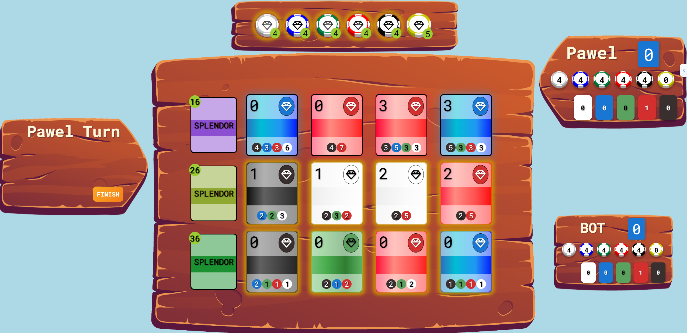

# 🃏 Splendor – A Browser-Based Board Game

This is my own implementation of the **Splendor** board game built for the browser.  
I created this project to deepen and complete my understanding of:

- 🎯 **JavaScript** – DOM manipulation, events, classes, and modules  
- 🎨 **HTML & CSS** – layout, responsive design, animations, and image handling  
- 🧱 **Object-Oriented Architecture** – class structure, game state management, and modularity  

All gameplay mechanics, such as taking tokens, purchasing cards, and earning points, are implemented from scratch.

---

## 🎮 Game Screenshot



---

## 📚 Project Goals

The main goals of this project were to:

- Practice **vanilla JavaScript** without relying on frameworks  
- Gain a better understanding of game logic and structure  
- Learn how to work with images and layout in CSS  
- Build a project that can be expanded (e.g. multiplayer, AI, online mode)

---

## 🚀 How to Run the Game

You can launch the project in a few different ways:

### ✅ Option 1 – Live Server (Development)

Open the project in your code editor and use the **Live Server** extension (e.g., in VS Code)  
to open `index.html` in the browser.

### ✅ Option 2 – Electron App

The game can also run as a desktop app using **Electron**.

Install dependencies and start the app:

```bash
npm install
npm start
